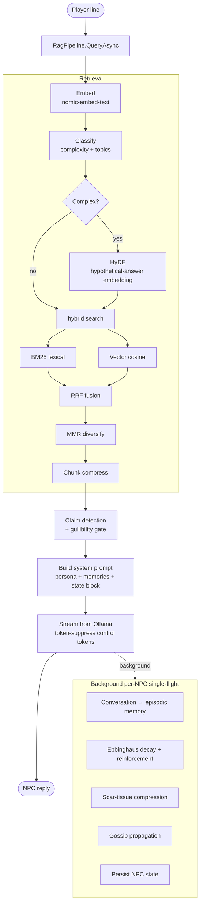

# NPC RAG System

**A retrieval-augmented dialogue engine for text-RPG NPCs that behave like people**. With this system, the NPCs become more than wrought script. They remember you, they warm up to you with conversation, or cool off with alteractions. They keep daily schedules, move around the world, gossip with one another, or keep secrets close to their chest.

The system is written in **C#** and runs entirely on **local inference via Ollama**, so no cloud dependency for play. Here, data has been authored in an original setting to powers conversations in an original world (the city of **Antitheis** on the world of **Ath**, and the frontier town of **Carvallen**), however, for individuals looking to use this themselves, all of the data can be self authored and inserted to make work.

> **Status:** the engine and world are built and playable today on a stock local model
> (`hermes3:8b` / `llama3.1:8b` via Ollama). A fine-tune track to bake character voice into the
> weights is in progress and **not required to run**. See [Roadmap](docs/ROADMAP.md).

---

## What's the point?

Most "AI NPC" are a system prompt and a chat box, but this is a full cognition stack:

* **Hybrid retrieval over world lore**. Dense vector search and BM25 lexical search, fused with Reciprocal Rank Fusion, diversified with MMR, with HyDE query expansion and chunk compression.
* **NPCs with decaying memory**. Episodic memory on a Ebbinghaus forgetting curve, with reinforcement, emotional weighting (flashbulb memories), and "scar-tissue" compression that blurs old memories into hazy impressions instead of deleting them.
* **Emotional and Relationship driven tone**. NPCs carry fear/anger/grief/…, physical state (exhaustion/pain/…), and a per-player relationship (trust/care/gullibility/…).
* **Social consequences**. Claim detection (NPCs can detect lies based on gullibility), gossip propagation between nearby NPCs, and player-behavior tracking (acting insane or contradict yourself and NPCs treat you as unstable).

---

## Architecture



Full request-flow walkthrough, code map, and technique catalog: [**docs/ARCHITECTURE.md**](docs/ARCHITECTURE.md).

---

## Running it

You need [**Ollama**](https://ollama.com/download) and the [**.NET 8 SDK**](https://dotnet.microsoft.com/download).

```bash
# 1. Install Ollama, then pull the two models the app talks to:
ollama pull llama3.1:8b        # chat model (hermes3:8b also works — pick at startup)
ollama pull nomic-embed-text   # embeddings

# 2. Make sure Ollama is serving (it runs a local server on :11434):
ollama serve                   # usually already running after install

# 3. Build and run:
dotnet run                     # add --dev for developer commands
```

On first run the app embeds all lore and caches it to `Data/Cache/embedding_cache.json`
(subsequent starts are fast). Edits to `Data/` need a rebuild + **New Game** so saves reseed
from the templates.

> The app never downloads a model file by hand. `ollama pull` fetches the weights onto your
> machine and the C# code talks to Ollama's local HTTP API. Nothing model-sized lives in this
> repository.

---

## Playing

You wake with no memory, face-down in a horse trough outside an inn. Type `1` to head into the
Sleeping Hound and start talking your way back to who you are.

**At a location** you'll see the people present and the ways out, numbered:
- Type a person's **number or name** to talk to them.
- Type an exit's number, or `move`, to travel there.
- `look` re-shows the room · `time` checks the day and hour · `quit` saves and exits.

**In a conversation** just type what you want to say and press Enter:
- Pressing Enter on an **empty line** means you say nothing — the NPC reacts to your silence.
- `leave` ends the conversation and returns you to the room.

NPCs remember what you say and how you treat them, hold their own moods and schedules, and talk
amongst themselves, so talk to them like people, not menus. Your game saves automatically;
relaunching offers to continue where you left off.

---

## Documentation

|Doc|What's in it|
|-|-|
|[**docs/ARCHITECTURE.md**](docs/ARCHITECTURE.md)|The request flow end to end, the code map, config, a full catalog of the retrieval + memory techniques, and how to diagnose common issues.|
|[**docs/DEEP_DIVE.md**](docs/DEEP_DIVE.md)|Annotated walkthroughs of the intricate parts (RRF, MMR, HyDE, the Ebbinghaus curve, streaming token suppression, claim detection) *with the actual code*.|
|[**docs/ROADMAP.md**](docs/ROADMAP.md)|Where this is going: the fine-tune track, planned world-events / privacy-gated disclosure / reflection / neurosymbolic-consistency systems, and known limitations.|

---

## Project layout

```
Program.cs            Entry point — builds every service, runs the game loop
Game/                 The REPL: location loop, conversation loop, dev commands
RAG/                  The pipeline — Pipeline/, Retrieval/ (incl. vector store + BM25), Classification/
State/                Live game state — Managers/ (logic) + Repositories/ (load/save)
Domain/               Domain data types (NpcState, EmotionalState, memories, …)
Services/             Ollama LLM + embedding clients, training-data logger
Configuration/        App config (SystemConfig, sampling, feature flags)
Utils/                Shared helpers (string/JSON utils, console, accents)
Data/                 Authored content — World/ (npcs, locations, accents), Lore/, Classifier/, SaveTemplate/
ml/                   Fine-tune + control-vector workshop (weights gitignored)
docs/                 Architecture, deep dive, roadmap
```
